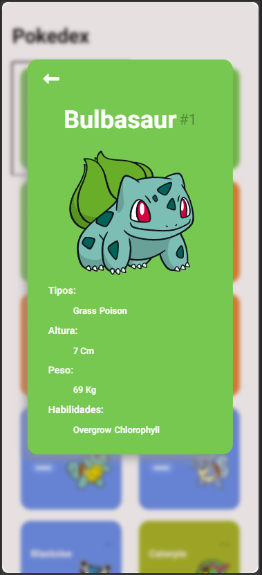
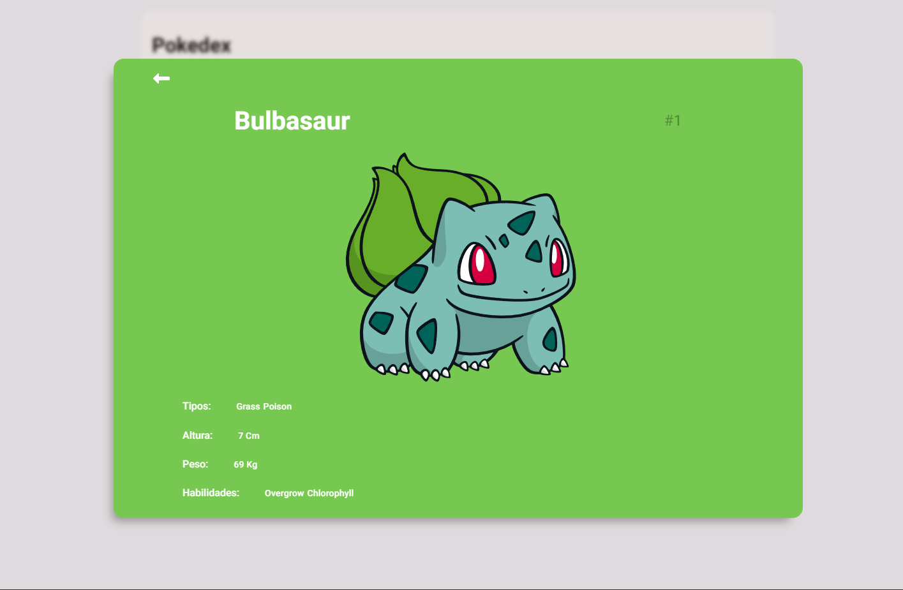

# Pokedex 📟

## Descrição

Este projeto consiste em uma _Pokedex_ virtual focada na exibição abrangente de informações sobre todos os Pokémon da primeira geração. Para obter os dados necessários, a aplicação utiliza a `Fetch API` para realizar requisições à API `pokeapi.co`. Essa abordagem permite uma experiência interativa e informativa, apresentando detalhes essenciais, como estatísticas, tipos e descrições, diretamente aos usuários interessados em explorar o vasto universo dos Pokémon da primeira geração.

## Conteúdos abordados

Este projeto foi desenvolvido com base nos cursos **Criando um Projeto com HTML/CSS para Listagem de Pokémon** e **Dominando o Protocolo HTTP e Integrando com a PokeAPI**. A implementação combina elementos de design utilizando `HTML/CSS` para criar uma interface atrativa e funcional. Além disso, o curso sobre o protocolo HTTP foi crucial para compreender como realizar integrações eficazes com a API da `PokeAPI`, possibilitando a busca e exibição detalhada de informações sobre Pokémon da primeira geração. O resultado é uma Pokedex interativa e informativa, proporcionando uma experiência envolvente para os usuários explorarem o vasto mundo dos Pokémon clássicos.

- **CSS**

  - A importância do `Normalize CSS`
  - O conceito `Mobile First`
  - Os displays `Grid Layout` e `Flexbox`
  - A utilização de `Media Queries`

- **Javascript**

  - Função `map()` para criar uma lista a partir de outra lista de forma eficiente
  - Função `join()` para transformar listas em strings
  - Uso da `Fetch API` para efetuar as requisições

- **Requisição HTTP**
  - `URL` como `Endereço` / `Caminho`
  - `Request Methods` que pode ser `POST`, `GET`, `PUT` ou `DELETE`, além de vários outros tipos
  - `Path Params` e `Query Strings`
  - `Request Headers` que é o cabeçalho da requisição
  - `Request Body` que é o corpo de alguns tipos de requisição
  - `Status Code` que indica o que houve com a requisição

## Imagem do site

### Visualização da listagem de pokemons

### Visualização dos detalhes dos pokemons

#### Mobile

#### Tab

#### Web

## Mais informações

Este projeto fez parte da trilha Fundamentos de Front-End do bootcamp **Desenvolvimento Frontend com Angular** da **Digital Innovation One**. O mesmo projeto postado no Github foi entregue, como pedido, na plataforma da DIO.

## Links

- [🔍 Meu perfil na DIO](https://www.dio.me/users/aliciabmendes)
- [🔍 Digital Innovation One](https://www.dio.me/)
- [🔍 Fetch API | MDN](https://developer.mozilla.org/en-US/docs/Web/API/Fetch_API)
- [🔍 Poke API](https://pokeapi.co/)
- [🔍 Repositório Base do Projeto](https://github.com/digitalinnovationone/js-developer-pokedex)
